# 

## 🙋 About Me

<table>
<tr>
<td valign="middle" width="50%">

- 🎓 I'm a **Computer Science and Technology** student

- 💻 Interested in **coding, open source, and building useful things**

- 🌱 Currently learning **new technologies and improving my projects**

- 🚀 Always exploring better ways to create and solve problems

</td>
<td width="50%" align="center">

</td>
</tr>
</table>

## 🛠 Languages and Tools

​

## 📊 Activity Status

<table width="100%">
  <tr>
    <td width="50%" valign="top">
      
    </td>
    <td width="50%" align="center" valign="middle">
      
    </td>
  </tr>
</table>

  ## 📫Connect

I love meeting new people! Reach me through:

✉ Email: [3632378642@qq.com](mailto:3632378642@qq.com)

<!--
**larkz-hh/larkz-hh** is a ✨ _special_ ✨ repository because its `README.md` (this file) appears on your GitHub profile.

Here are some ideas to get you started:

- 🔭 I’m currently working on ...
- 🌱 I’m currently learning ...
- 👯 I’m looking to collaborate on ...
- 🤔 I’m looking for help with ...
- 💬 Ask me about ...
- 📫 How to reach me: ...
- 😄 Pronouns: ...
- ⚡ Fun fact: ...
-->
